# zmosh-picker

Single-keypress session launcher for [zmosh](https://github.com/mmonad/zmosh). Open a terminal, see your sessions, press one key.

<p align="center">
  
</p>

## Why

Persistent sessions should be the default, not something you opt into. Whether you're on your Mac, SSH'd from an iPad, or mosh'd from your phone — you should be able to pick up any session instantly.

**The problem:** Every time you open a terminal, you start fresh. Your previous context is gone. On mobile, typing `zmosh attach my-long-session-name` is painful. Across devices, you forget what sessions exist.

**The solution:** Every terminal opens with a single-keypress picker. Press `1` to resume. Press `Enter` to start fresh. Press `z` to jump to any project. One keypress, every time, on any device.

## Dependencies

| Dependency | Required | Purpose |
|-----------|----------|---------|
| [zmosh](https://github.com/mmonad/zmosh) | **Yes** | Session persistence (fork of [zmx](https://github.com/neurosnap/zmx) with UDP remote support) |
| [zoxide](https://github.com/ajeetdsouza/zoxide) | No | Interactive directory picker (for `z` key) |
| [fzf](https://github.com/junegunn/fzf) | No | Fuzzy finder (used by zoxide's interactive mode) |

```bash
# Install dependencies (macOS)
brew install mmonad/tap/zmosh
brew install zoxide    # optional
brew install fzf       # optional, used by zoxide
```

## Install

```bash
git clone https://github.com/nerveband/zmosh-picker.git
cd zmosh-picker
./install.sh
```

The install script will:
- Check for dependencies and warn about anything missing
- Copy `zmosh-picker` to `~/.local/bin/`
- Add a source hook to your `~/.zshrc` (placed before p10k instant prompt if present)

Then open a new terminal.

## Usage

Every new terminal shows the picker:

```
  zmosh 3 sessions

  1  api-server * ~/projects/api-server
  2  dotfiles . ~/dotfiles
  3  ai-happy-design . ~/Doc/GH/ai-happy-design

  enter new myproject-1
  z     pick dir  d +date  esc skip

  >
```

### Keys

| Key | Action |
|-----|--------|
| `1`-`9` | Attach to listed session |
| `a`-`y` | Attach to sessions 10+ |
| `Enter` | New session in current directory |
| `z` | Pick directory with zoxide, then new session |
| `d` | New session with date suffix (MMDD) |
| `Esc` | Skip — plain shell, no zmosh |

All keys are single-press. No typing, no Enter to confirm.

### Session naming

| Key | Format | Example |
|-----|--------|---------|
| `Enter` | `<dirname>-<N>` | `api-server-1`, `api-server-2` |
| `d` | `<dirname>-MMDD` | `api-server-0220` |
| `z` | `<picked-dir>-<N>` | `ai-happy-design-1` |

The counter auto-increments past existing sessions.

### Session indicators

- `*` (green) — session has active clients (someone's connected)
- `.` (dim) — session is idle (pick it up from another device!)

## How it works

1. The `.zshrc` hook sources `zmosh-picker` before p10k instant prompt
2. The script calls `zmosh list` once to get active sessions
3. Displays a compact menu with color-coded keys
4. Reads a single keypress with `read -k1`
5. On selection, `exec zmosh attach <name>` replaces the shell — no wrapper process

If you pick a session, the rest of `.zshrc` is skipped entirely (the `exec` replaces the process). This actually makes session resumption *faster* than a normal shell startup.

### Guards

The picker silently skips when:
- Already inside a zmosh session (`$ZMX_SESSION` is set)
- Not an interactive shell
- stdin is not a terminal (piped input)
- `zmosh` is not installed

## Mobile-friendly design

The compact layout fits narrow screens (30+ char width). Action keys are stacked on two lines instead of one long row. Session names are not padded. Everything is designed so you can SSH from Blink Shell or Termius on your phone, see your sessions, and press one key.

## Related projects

- [zmosh](https://github.com/mmonad/zmosh) — Session persistence with encrypted UDP auto-reconnect
- [zmx](https://github.com/neurosnap/zmx) — The original session persistence tool zmosh is built on
- [zmx-session-manager](https://github.com/mdsakalu/zmx-session-manager) — TUI session manager for zmx/zmosh (Bubble Tea)
- [zoxide](https://github.com/ajeetdsouza/zoxide) — Smarter `cd` command with frecency-based directory jumping
- [fzf](https://github.com/junegunn/fzf) — Fuzzy finder used by zoxide's interactive mode

## Design decisions

See [docs/plans/2026-02-20-zmosh-picker-design.md](docs/plans/2026-02-20-zmosh-picker-design.md) for the full design rationale.

## Uninstall

```bash
./uninstall.sh
```

## License

MIT
